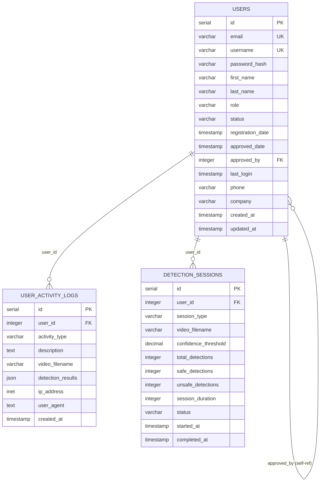

# PPE Detection System - Database ERD

## Visual ERD (Mermaid.js)

Copy this code to [Mermaid Live Editor](https://mermaid.live/) for interactive diagram:

## How to Use:
1. Copy the mermaid code above
2. Go to https://mermaid.live/
3. Paste the code in the editor
4. View the interactive ERD diagram
5. Export as PNG, SVG, or PDF
