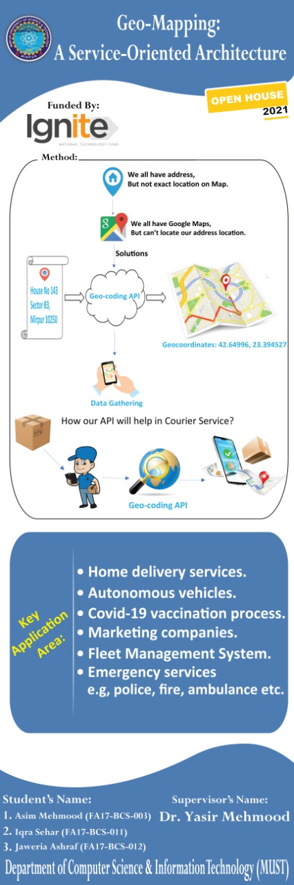

First part - title of fyp
Second part - working diagram in iconic form 
Third part - main features and application areas
Fourth part - group members name with supervisor
Fifth part - department name.

so we have to desing a working/method diagram and u have to help me in it. First working/method diagram [second part] then key application areas [leave part first, fourth and fifth]. 
Diagram path:   or "C:\Users\stxrdust\Desktop\PPE\PPE\pamphlet.jpg"